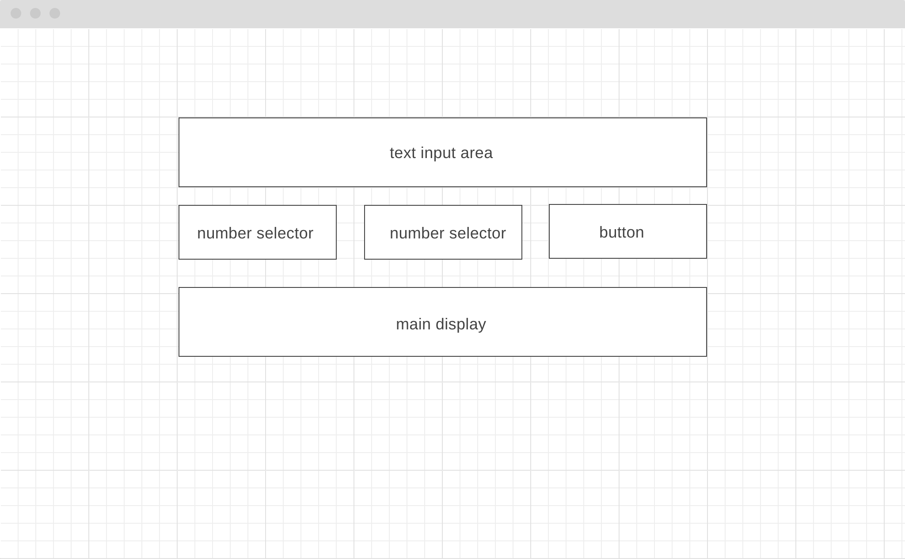

# User Input Code-Along

In this code-along you will create a simple web page with a single user story:

* As a user I can enter some text and select a substring of that text to be shown in the main display.

Your site will respond to a user-generated event, read & processing user inputs from the DOM, and displaying the result back to the DOM.

### Index

* [Learning Objectives](#learning-objectives)
* [Instructions](#instructions)
* [Target Page](#target-page)
* [Study Links](#study-links)
* [For Coaches](#for-coaches)

---

## Learning Objectives

* Implement a single user story that involves user input
* Breaking your project down, and separating your scripts by concern
* Refactoring and testing logic
* Casting user input from Strings to Numbers
* Reading and writing from the DOM
* Setting event listeners

[TOP](#responsive-code-along)

---

## Instructions

1. Fork this repository, turn on GitHub pages, and clone
1. Study the [wireframe](#wireframe)
1. Plan the code you will write in [./development-strategy.md](./development-strategy.md)
1. Develop one step at a time, each step on a separate branch
    1. Setup: Make sure all of your boilerplate code is ready
    1. DOM: Structure your UI according to the wireframe
    1. Style: Change the layout of the UI for better UX
    1. Listener: Respond to specific user actions
    1. Handler: Decide what to do when the user acts
    1. Logic: Refactor and test the core logic of your app
1. Push each branch to GitHub
1. Have a nice day!

[TOP](#responsive-code-along)

---

## Wireframe

[TOP](#responsive-code-along)

---

## Study Links

[TOP](#responsive-code-along)

---

## For Coaches

Any tips, resources or examples that will help lead this code-along?  PR's are more than welcome!

* [Leading great code-alongs](https://teachtogether.tech/#s:performance-live)

[TOP](#responsive-code-along)

---
---

### 
